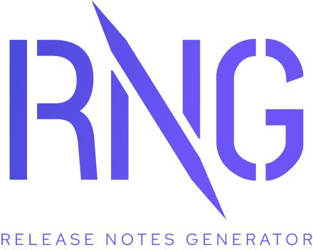

[![Build & Test][build-badge]][build-link]
[![GitHub license][license-image]][repo-link]
[![Version][version-image]][repo-version-link]

<p align="center">
  
</p>

---

This project was born to **automate the communication between developers and final users.**

A **complete markdown** file will be created using your pull request descriptions. 

<details>
	<summary>How Release Notes are done</summary>

1. Parse every PR **in latest RELEASE**.
	
2. **Filter** Pull Requests by label.
	
3. Add PR title and description to `RELEASE-NOTE.md`.

4. **Mark** Release note section as feature, bug, refactor, etc.
	
5. If you set `publish: true` 
    - All changes will be commited to your repo.
    - Tag pull requests with `in-release-note` label.
	
6. Execute plugins, like TEAMS webhooks
	
</details>

<details>
	<summary>Supported Repos</summary

- **GITHUB** via [@octokit](https://github.com/octokit/octokit.js).

- **TEAMS** via Webhooks.
		
</details>

---

# Documentation

- [Install](#install)
- [Configuration](/src/configuration#configuration-file)
  - [summary](/src/configuration#summary)
  - [token](/src/configuration#token)
  - [repo](/src/configuration#repo)
  - [name](/src/configuration#name)
  - [out](/src/configuration#out)
  - [split](/src/configuration#split)
  - [filter](/src/configuration#filter)
  - [snapshot](/src/configuration#snapshot)
  - [labels](/src/configuration#labels)
  - [ignoreTag](/src/configuration#ignore-tag)
  - [title](/src/configuration#title)
  - [decoration](/src/configuration#decoration)
  - [preview](/src/configuration#preview)
  - [publish](/src/configuration#publish)
  - [branch](/src/configuration#branch)
  - [message](/src/configuration#message)
  - [webhooks](/src/configuration#webhooks)
  - [notification](/src/configuration#notification)
- [CI Configuration](#ci-configuration)
- [Cli commands](/src/commander#readme)
- [Example](#example)

<br/>
		
# Install

```bash
npm i -D "@adrian.insua/relase-notes-generator"
```
		
<br/>

# CI Configuration

**RNG** uses [TOKEN](/src/configuration#token) to authorize process repository access in CI.

If you want to push changes to a **protected_branch** you'll need to use an access token with enough permissions.

1. Create a **personal access token** with enough permissions.
2. Add it as a secret in your project configuration.
3. Update your workflow to use it as auth token for **rng**

```yml
  run: npm run rng
  env:
    GITHUB_TOKEN: ${ secrets.ADMIN_TOKEN }
```

### Preview in pull request

You can see how RELEASE NOTES will look like using `preview` and `issue` attribute

<details>
  <summary>Github Actions</summary>

#### Workflow 

```yml
name: Preview Release Notes in PR

on:
  workflow_dispatch:
  pull_request:
    branches:
      - develop

jobs:
  build:
    name: Release notes preview
    runs-on: ubuntu-latest
    steps:
      - uses: actions/checkout@v2
        with:
          persist-credentials: false
      - uses: actions/setup-node@v2
        with:
          node-version: 16
      - run: npm ci
      - run: npm run build
      - run: npm run preview -- ${{ github.event.number }}
        env:
          GITHUB_TOKEN: ${{ secrets.ADMIN_TOKEN }}
```

```json
{ 
  "scripts": {
    "preview": "rng gen -v --snapshot -f '' --issue"
  }
}
```

Workflow steps:

- Pass  `issue` to `preview` script.
- Set [snapshot](/src/configuration#snapshot) flag to parse pull requests since latest release.

##### Custom configuration file

You can use a custom config file for this process

```json
{ 
  "scripts": {
    "preview": "rng gen -v -c .releasenotes-preview.yml --issue"
  }
}
```

```yaml
# releasenote-preview
snapshot: true
filter: ''
decoration:
  type/feature: '## :sparkles: '
  type/bug: '## :bug: '
```
</details>

# Example

```yml
# releasenotesrc.yml

message: "chore: update RELEASE-NOTES [skip ci]"
token: TOKEN
repo: RELEASE_NOTES_TEST
split: true
out: '.'
ignored-labels:
  - in-release-note
  - released
assets:
  - CHANGELOG.md
  - package.json
decoration:
  type/feature: '## :zap: '
  type/bug: '## :bug: '
```

```
// .env

TOKEN=<your-repo-token>
RELEASE_NOTES_TEST=adrianiy/release-notes-generator
```

### Output

```markdown
# RELEASE NOTES

# :rocket: Mock testing issue 
###### 2021-10-13

## :zap: Test Issue

This issue is used by release-notes-generator for test purposes
```

Check out our [RELEASE NOTES](/release-notes)

[build-badge]: https://github.com/adrianiy/release-notes-generator/workflows/Build%20&%20Test/badge.svg
[build-link]: https://github.com/adrianiy/release-notes-generator/actions?query=workflow%3A"Build+%26+Test"
[license-image]: https://badgen.net/github/license/adrianiy/release-notes-generator
[version-image]: https://badgen.net/github/release/adrianiy/release-notes-generator/stable
[repo-link]: https://github.com/adrianiy/release-notes-generator
[repo-version-link]: https://github.com/adrianiy/release-notes-generator/releases
